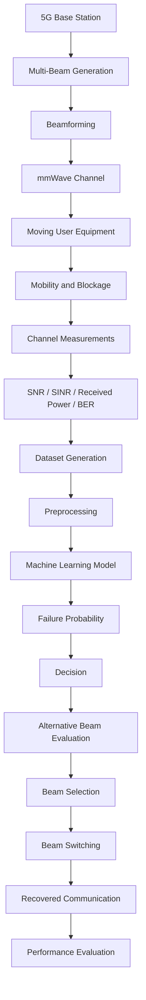
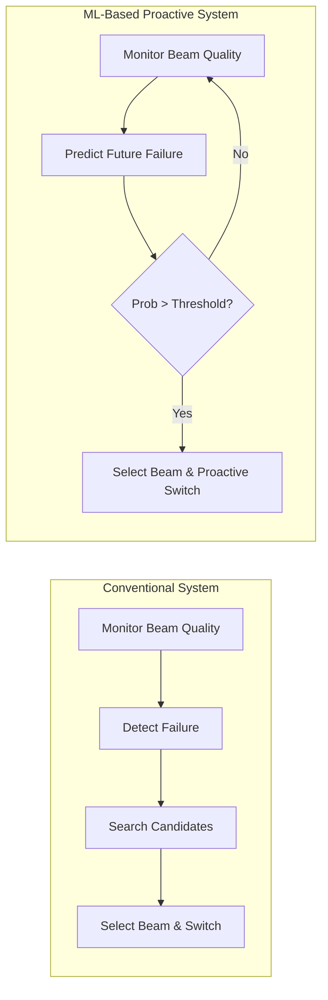

# System Architecture Diagram

```mermaid
flowchart TD
    A[5G Base Station] --> B[Multi-Beam Generation]
    B --> C[Beamforming]
    C --> D[mmWave Channel]
    D --> E[Moving User Equipment]
    E --> F[Mobility and Blockage]
    F --> G[Channel Measurements]
    G --> H[SNR / SINR / Received Power / BER]
    H --> I[Dataset Generation]
    I --> J[Preprocessing]
    J --> K[Machine Learning Model]
    K --> L[Failure Probability]
    L --> M[Decision]
    M --> N[Alternative Beam Evaluation]
    N --> O[Beam Selection]
    O --> P[Beam Switching]
    P --> Q[Recovered Communication]
    Q --> R[Performance Evaluation]
```

# Conventional vs Proposed Flowchart

```mermaid
flowchart LR
    subgraph Conventional System
        C1[Monitor Beam Quality] --> C2[Detect Failure]
        C2 --> C3[Search Candidates]
        C3 --> C4[Select Beam & Switch]
    end
    subgraph ML-Based Proactive System
        M1[Monitor Beam Quality] --> M2[Predict Future Failure]
        M2 --> M3{Prob > Threshold?}
        M3 -- Yes --> M4[Select Beam & Proactive Switch]
        M3 -- No --> M1
    end
```
